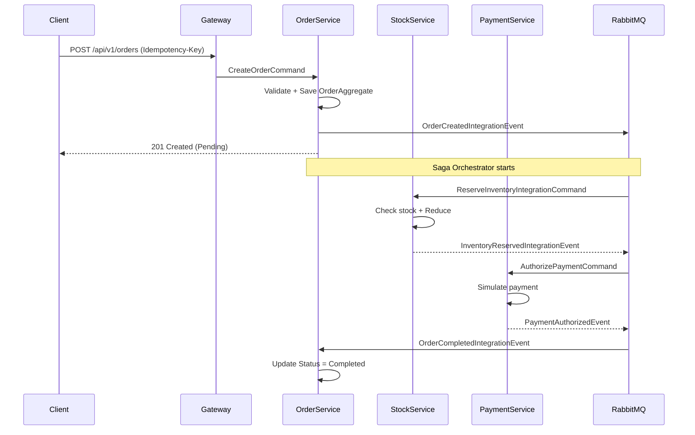

# 🍕 PizzaSaga — Distributed Order Processing Platform

> **Senior-level .NET Backend Project**  
> *Распределённая микросервисная система обработки заказов с демонстрацией современных архитектурных паттернов и production-подходов к надёжности.*

---

## 🎯 Что показывает проект

Этот проект демонстрирует **глубокое понимание распределённых систем** на платформе .NET 10:

| Компетенция | Реализация в проекте |
|-------------|----------------------|
| **Архитектура микросервисов** | Clean Architecture + Vertical Slices + Tactical DDD |
| **Событийное взаимодействие** | RabbitMQ + MassTransit State Machine (Saga Orchestration) |
| **Гарантированная доставка** | Transactional Outbox Pattern (EF Core + PostgreSQL) |
| **Идемпотентность** | Inbox (MassTransit) + HTTP Idempotency (PostgreSQL-based) |
| **Надёжность** | Optimistic Concurrency, Dead Letter Queue, Retry Policies |
| **Наблюдаемость** | OpenTelemetry Tracing + Metrics + Structured Logging |
| **Безопасность** | JWT Authentication + API Gateway (YARP) |
| **DevOps & Tooling** | .NET Aspire AppHost, Docker Compose, Health Checks |

Проект разрабатывается по принципам **production-grade backend**: эволюционная архитектура, чёткие границы bounded contexts, отказ от распределённых транзакций в пользу eventual consistency.

---

## 🏗️ Архитектура

```
                    +-------------------+
                    |     Client        |
                    +---------+---------+
                              │ HTTPS + JWT
                              ▼
              +-------------------------------+
              |      API Gateway (YARP)       |
              | • JWT Validation              |
              | • CorrelationId Propagation   |
              | • Service Discovery           |
              +---------------+---------------+
                              │
        ┌─────────────────────┼─────────────────────┐
        ▼                     ▼                     ▼
+------------------+  +------------------+  +------------------+
|   Auth Service   |  | Order Service    |  | Catalog Service  |
| • JWT Issuing    |  | • Saga           |  | • Product Catalog|
|                  |  | • Vertical Slices|  | • Prices Cache   |
+------------------+  +------------------+  +------------------+
                              │                     │
                    Publish / Consume Events      │
                              │                     ▼
                       +--------------+     +------------------+
                       |   RabbitMQ   |     |   Stock Service  |
                       +-------+------+     | • Reservations   |
                               │            | • Inventory        |
                        ┌──────┴──────┐     +------------------+
                        ▼             ▼
                  +-----------+  +-------------+
                  | Payment   |  |   Order     |
                  | Service   |  | State Machine|
                  +-----------+  +-------------+
```

### 🔁 Бизнес-процесс (Order Saga)



---

## 📦 Технологический стек

| Слой | Технология |
|------|------------|
| **Платформа** | .NET 10, ASP.NET Core Minimal API |
| **ORM** | Entity Framework Core + Npgsql.EntityFrameworkCore.PostgreSQL |
| **Базы данных** | PostgreSQL (каждый сервис — своя БД) |
| **Сообщения** | RabbitMQ + MassTransit (State Machine + Transactional Outbox) |
| **API Gateway** | YARP Reverse Proxy |
| **Аутентификация** | JWT Bearer Tokens |
| **Наблюдаемость** | OpenTelemetry (Tracing, Metrics, Logs), .NET Aspire Dashboard |
| **Валидация** | FluentValidation + Parse-Don't-Validate (Value Objects) |
| **Оркестрация** | Mediator Pattern (CQRS) + Pipeline Behaviors |
| **Инфраструктура** | .NET Aspire AppHost, Docker Compose |

---

## 🚀 Как запустить

### 1. Запуск через .NET Aspire (рекомендуется)

```bash
# Убедитесь что установлен .NET 10 SDK и Docker Desktop
cd src/Host/PizzaSaga.AppHost
dotnet run --launch-profile PizzaSaga.AppHost
```

Система автоматически:
- Поднимет контейнеры: PostgreSQL (4 БД), RabbitMQ, PgAdmin
- Запустит все микросервисы с зависимостями (`WaitFor`)
- Настроит миграции и seed-данные

### 2. Проверка работоспособности

| Служба | URL |
|--------|-----|
| **API Gateway (Swagger UI)** | `http://localhost:<gateway-port>/swagger` |
| **Auth Service** | `POST /api/v1/auth/login` → JWT token |
| **Order Service** | `POST /api/v1/orders` (с JWT + Idempotency-Key) |
| **Catalog Service** | `GET /api/v1/catalogs/test2` (seed-данные) |
| **.NET Aspire Dashboard** | `http://localhost:17074/` |

### 3. Пример запроса создания заказа

```bash
# Получить JWT
curl -X POST https://localhost:<auth-port>/api/v1/auth/login \
  -H "Content-Type: application/json" \
  -d '{"email":"test_user","password":"password"}'

# Создать заказ (вставить токен и сгенерировать GUID для Idempotency-Key)
curl -X POST https://localhost:<gateway-port>/api/v1/orders \
  -H "Authorization: Bearer <your-jwt>" \
  -H "Idempotency-Key: $(New-Guid)" \
  -H "Content-Type: application/json" \
  -d '{
    "items": [
      {"productId": "eba653b0-f324-47d9-947b-99e76c7d6a1c", "quantity": 2}
    ],
    "paymentMethod": "Card",
    "currency": "EUR"
  }'
```

---

## 🧠 Архитектурные решения и trade-offs

### Почему **Saga Orchestration**, а не Choreography?
- Централизованное управление состоянием заказа
- Простая компенсация ошибок (команды отмены резерва/оплаты)
- Чёткая граница ответственности между сервисами

### Почему **Transactional Outbox**, а не прямая публикация в RabbitMQ?
- Гарантирует атомарность: сохранение заказа + событие в Outbox происходят в одной транзакции
- Предотвращает потерю событий при сбое приложения после коммита БД

### Почему **Optimistic Concurrency**, а не Pessimistic?
- Подходит для распределённых систем с высоким числом параллельных заказов
- EF Core `IsConcurrencyToken()` + `DbUpdateConcurrencyException` → автоматический retry через `IExecutionStrategy`

### Почему **Vertical Slices**, а не классические Controllers/Services?
- Чёткая изоляция бизнес-функций (CreateOrder, GetOrders)
- Упрощённое тестирование и рефакторинг
- Следование Clean Architecture без избыточной абстракции

---

## 📊 Что реализовано (Sprint 0–2)

| План | Статус | Описание |
|------|--------|----------|
| **Sprint 0** | ✅ | API Gateway (YARP), JWT, CorrelationId, OpenTelemetry, Health Checks, Auth Service (POST /login) |
| **Sprint 1** | ✅ | Vertical Slices, CQRS + Mediator, FluentValidation, TransactionBehavior, Optimistic Concurrency, HTTP Idempotency |
| **Sprint 2** | 🟡 | Order Saga State Machine, RabbitMQ integration, Catalog Service (seed), Currency Exchange Rates, Outbox pattern |

> **Примечание**: Проект находится в активной разработке. Полный стек функциональности описан в `docs/план спринтов.txt`.

---

## 🔍 Демонстрация на интервью

### 1. Показать распределённый трейс
- Открыть .NET Aspire Dashboard → Traces
- Фильтровать по CorrelationId из запроса создания заказа
- Увидеть цепочку: Gateway → Order.Api (POST /orders) → RabbitMQ → Stock/Consumers

### 2. Проверить надёжность
- Симулировать сбой в Payment Service (флаг `SimulateFailure = true`)
- Проверить, что Сага автоматически отправляет команду отмены резерва (`ReleaseInventoryIntegrationCommand`)
- Убедиться, что остатки на складе восстановились

### 3. Продемонстрировать метрики
- В .NET Aspire Dashboard → Metrics
- Показать кастомные счетчики (orders-created-count, sagas-completed-count)

---

## 📚 Документация

| Файл | Назначение |
|------|------------|
| `docs/architecture.md` | Полное описание архитектуры и принципов проектирования |
| `docs/api.md` | Спецификация публичного HTTP API (RFC 9457, ProblemDetails) |
| `docs/задание на пет-проект.txt` | Техническое задание с целями и критериями приемки |
| `docs/план спринтов.txt` | Эволюционный план разработки (Sprint 0–6) |

---

## 🏆 Для чего это нужно в резюме

Этот проект показывает **Senior-level компетенции**:

- ✅ Глубокое понимание распределённых систем (Saga, Outbox, Idempotency)
- ✅ Умение проектировать эволюционную архитектуру (Clean + DDD + Vertical Slices)
- ✅ Опыт работы с production-инструментами (.NET Aspire, OpenTelemetry, RabbitMQ)
- ✅ Понимание trade-offs: eventual consistency vs. distributed transactions
- ✅ Готовность к масштабированию (Database per Service, stateless services)

> **Целевая позиция**: Senior Backend Developer / Distributed Systems Engineer / .NET Specialist
